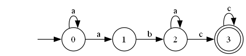
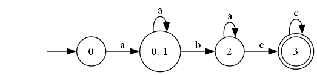

# Laboratory Work No. 2

### Course: Formal Languages & Finite Automata  
### Author: Nicolae Marga
### Group: FAF-231

----

## Theory
The word finite from Finite Automaton signifies the fact that an automaton comes with a starting and a set of final states. For processes modeled by an automaton, it should have a beginning and may have multiple endings or even hit dead states.
Based on the structure of an automaton, there are cases in which with one transition multiple states can be reached which causes non determinism to appear. In general, when talking about systems theory the word determinism characterizes how predictable a system is. The automata can be classified as non-/deterministic (DFA and NDFA), and there is in fact a possibility to reach determinism by following algorithms which modify the structure of the automaton.

## Objectives:
Understand what an automaton is and what it can be used for.

- Provide a function in your grammar type/class that could classify the grammar based on Chomsky hierarchy.
- For this you can use the variant from the previous lab.
According to your variant number (by universal convention it is register ID), get the finite automaton definition and do the following tasks:
- Implement conversion of a finite automaton to a regular grammar.
- Determine whether your FA is deterministic or non-deterministic.
- Implement some functionality that would convert an NDFA to a DFA.
- Represent the finite automaton graphically (Optional, and can be considered as a bonus point).

## Implementation description

### Grammar Class
### Grammar Class Methods:
The Grammar class has sever key methods, which include:

 - Grammar Classification

The get_type() method is pivotal in determining the type of grammar according to the Chomsky hierarchy, a classification scheme for grammars introduced by Noam Chomsky. This hierarchy categorizes grammars into four types based on their production rules:

Type 0: Unrestricted Grammar - The most general form of grammar, with no restrictions on production rules.

Type 1: Context-Sensitive Grammar (CSG) - Grammars where the length of the left-hand side of a production rule is less than or equal to the length of the right-hand side.

Type 2: Context-Free Grammar (CFG) - Grammars with production rules where the left-hand side consists of a single non-terminal symbol.

Type 3: Regular Grammar - The simplest form, further divided into left-linear and right-linear grammars.

```python
    def get_type(self):
        left_type = False
        right_type = False
        is_cfg = True
        is_csg = True

        total_rules = []
        for productions_rule in self.productions.values():
            total_rules += productions_rule

        for lhs, rhs_list in self.productions.items():
            for rhs in rhs_list:
                # Check if the rule follows CFG format (A → gamma)
                if lhs not in self.non_terminals or len(lhs) != 1:
                    is_cfg = False

                # Check if the rule follows CSG format (|LHS| <= |RHS|)
                if len(lhs) > len(rhs):
                    is_csg = False

                # Check for Type 3 (Regular Grammar)
                if len(rhs) >= 2:
                    if all(rhs[i] in self.terminals for i in range(len(rhs) - 1)) and rhs[-1] in self.non_terminals:
                        right_type = True
                    elif rhs[0] in self.non_terminals and all(rhs[i] in self.terminals for i in range(1, len(rhs))):
                        left_type = True
                    else:
                        is_cfg = False

        if left_type and right_type:
            return "Not a Type 3 Grammar (Possibly CFG or higher)"

        if left_type:
            return "Type 3: Left Linear"
        elif right_type:
            return "Type 3: Right Linear"

        if is_cfg:
            return "Type 2: Context-Free Grammar"
        
        if is_csg:
            return "Type 1: Context-Sensitive Grammar"
        
        return "Type 0: Unrestricted Grammar"
```
### Grammar to Finite Automaton Conversion
The to_finite_automaton() method converts the given grammar into an equivalent finite automaton (FA). Finite automata are abstract machines used to recognize regular languages. This conversion is particularly useful for visualizing and analyzing the behavior of the grammar in a finite state system. The method creates states, transitions, and defines the start and final states of the automaton based on the grammar's production rules.

```python
def to_finite_automaton(self, final_states = None):
    final_state = 'dead'
    transitions = {}
    for non_terminal in self.non_terminals:
        transitions[non_terminal] = {}
    for non_terminal, productions in self.productions.items():
        for production in productions:
            if len(production) == 1:  # End terminal production
                transitions[non_terminal][production] = final_state
            elif self.type == 'Right Linear':
                transition, new_state = production[:-1], production[-1]
                if non_terminal in transitions and transition in transitions[non_terminal]:
                     transitions[non_terminal][transition].append(new_state)
                else:
                    transitions[non_terminal][transition] = [new_state]
                
            elif self.type == 'Left Linear':
                transition, new_state = production[1:], production[0]
                if non_terminal in transitions and transition in transitions[non_terminal]:
                     transitions[non_terminal][transition].append(new_state)
                else:
                    transitions[non_terminal][transition] = [new_state]
    
    if final_states == None:
        final_states = {final_state}
    return FiniteAutomaton(
        states=self.non_terminals.union(final_states),
        alphabet=self.terminals,
        start_state=self.start_symbol,
        final_states=final_states,
        transitions=transitions
    )
```
#### FiniteAutomaton Class
The FiniteAutomaton class represents both deterministic and non-deterministic finite automata (DFA and NDFA, respectively). Finite automata are crucial in the design and analysis of digital circuits, lexical analyzers in compilers, and various other applications in computer science and engineering. This class includes methods for checking determinism, converting to regular grammar, and converting NDFA to DFA.
### Determinism Check
The is_deterministic() method determines if the automaton is deterministic:
```python
def is_deterministic(self):
    for state, transitions in self.transitions.items():
        for symbol, next_states in transitions.items():
            if len(next_states) > 1:
                return False
    return True
```
### FA to Regular Grammar Conversion
The to_regular_grammar() method converts a finite automaton back into an equivalent regular grammar. This transformation highlights the dual nature of regular grammars and finite automata—both can represent the same set of languages known as regular languages. The method translates the state transitions of the automaton into production rules of the grammar.
```python
def to_regular_grammar(self):
    non_terminals = self.states 
    terminals = self.alphabet
    start_symbol = self.start_state
    rules = {nt: [] for nt in non_terminals}

    # Transform transitions into production rules
    for state, transitions in self.transitions.items():
        for symbol, next_states in transitions.items():
            for next_state in next_states:
                rules[state].append(f"{symbol}{next_state}")
                # If the next state is an accept state, add a production rule ending in the terminal
                if next_state in self.final_states and not self.transitions.get(next_state):
                    rules[state].append(symbol)

    return Grammar(non_terminals, terminals, rules, start_symbol)
```
#### NDFA to DFA Conversion
The to_dfa() method converts a non-deterministic finite automaton (NDFA) into a deterministic finite automaton (DFA). This conversion is necessary for certain computational tasks that require determinism, such as lexical analysis in compilers. The method uses a subset construction algorithm, where states in the DFA represent sets of states in the NDFA, ensuring that each input symbol leads to a unique next state.
```python
def to_dfa(self):
    if self.is_deterministic():
        return self
    init_s = self.start_state
    dfa_transitions = {}
    dfa_accept_states = []
    queue = [frozenset([init_s])]
    visited = set()
    dfa_states_map = {frozenset([init_s]): init_s}

    while queue:
        current_states = queue.pop(0)
        if current_states in visited:
            continue
    
        visited.add(current_states)

        if len(current_states) == 1:
            dfa_state_name = next(iter(current_states))
        else:
            dfa_state_name = ', '.join(sorted(current_states))
        dfa_transitions[dfa_state_name] = {}

        for symbol in self.alphabet:
            # Get the set of states for a given symbol
            next_states_set = set()  # Use a set to store unique next states

            for state in current_states:
                # Get the dictionary of transitions for the current state
                state_transitions = self.transitions.get(state, {})
                next_states = state_transitions.get(symbol, [])
                # Add the next states to the set
                next_states_set.update(next_states)
            # Convert to frozenset to maintain immutability
            next_states_set = frozenset(next_states_set)

            if not next_states_set:
                continue

            if len(next_states_set) == 1:
                next_state_name = next(iter(next_states_set))
            else:
                next_state_name = ', '.join(sorted(next_states_set))

            dfa_transitions[dfa_state_name][symbol] = [next_state_name]  

            if next_states_set not in dfa_states_map:
                dfa_states_map[next_states_set] = next_state_name
                queue.append(next_states_set)
            # If the newly formed state set intersects with an existing final state
            # Then set the new state as final
            if next_states_set.intersection(self.final_states):
                dfa_accept_states.append(next_state_name)

    dfa_states = list(dfa_states_map.values())
    
    return FiniteAutomaton(
        states=dfa_states,
        alphabet=self.alphabet,
        transitions=dfa_transitions,
        start_state=dfa_states_map[frozenset([self.start_state])],
        final_states=dfa_accept_states
    )
```
#### Graphical Representation
The create_diagram() method generates a visual representation of the automaton using the Graphviz library:
```python
def create_diagram(self):
    dot = Digraph(comment='Finite Automaton')
    dot.attr(rankdir='LR')

    # Add states
    for state in self.states:
        dot.node(state, state, shape='doublecircle' if state in self.final_states else 'circle')

    # Mark initial state
    dot.node('', '', shape='none')
    dot.edge('', self.start_state)

    # Add transitions
    for state, transitions in self.transitions.items():
        for symbol, next_states in transitions.items():
            for next_state in next_states:
                dot.edge(state, next_state, label=symbol)

    return dot
```

#### Results
For the finite automaton defined with the following parameters:
```python
Q = {'0', '1', '2', '3'}
Σ = {'a', 'b', 'c'}
F = {'3'}
start_state = '0'
transitions = {
    '0': {'a': ['0', '1']},
    '1': {'b': ['2']},
    '2': {'c': ['3'], 'a': ['2']},
    '3': {'c': ['3']},
}
```

The program produces a set of results that include a determinism check, which confirms the automaton is non-deterministic due to state '0' having multiple transitions for input 'a'. The conversion to grammar is implemented, transforming the automaton into an equivalent regular grammar with appropriate production rules.

```python
    print("Original defined transitions: " + str(transitions))
    # Create the finite automaton
    fa = FiniteAutomaton(Q, Σ, start_state, F, transitions)

    # Check if the automaton is deterministic
    print("Is the automaton deterministic?", fa.is_deterministic())

    # Conversion from fa to grammar
    grammar = fa.to_regular_grammar()
    print("The Converted Grammar G = {V_N, V_T, S, V_P}")
    print("V_N = " + str(grammar.non_terminals))
    print("V_T = " + str(grammar.terminals))
    print("S = " + str(grammar.start_symbol))
    print("V_P = " + str(grammar.productions))
    print("The type of Grammar: " + grammar.get_type())
    # Conversion from grammar back to fa
    fa = grammar.to_finite_automaton(F)
    fa.create_diagram().render('ndfa', format='png')

    dfa = fa.to_dfa()
    dfa.create_diagram().render('dfa', format='png')
```
Here is the displayed console output confirming execution of all operations.


Here is the graphical representations of the original non-deterministic automaton.


Here is the graphical representations of the converted deterministic automaton.


## Conclusions
This laboratory work demonstrated the implementation of key concepts in automata theory. It consisted of classification of grammars based on the Chomsky hierarchy, conversion between regular grammars and finite automata, determination of automaton determinism, conversion from NDFA to DFA, and graphical representation of automata. The implementation shows the relationship between regular grammars and finite automata, as well as the process of converting non-deterministic automata to deterministic ones. Through this work, it has been illustrated the theoretical connections between different formal language representations and practical algorithms to transform them, which improved the knowledge of the basic principles of computational theory in a practial, executable form.
## References

1. Formal Language & Automata Theory – Course Materials.