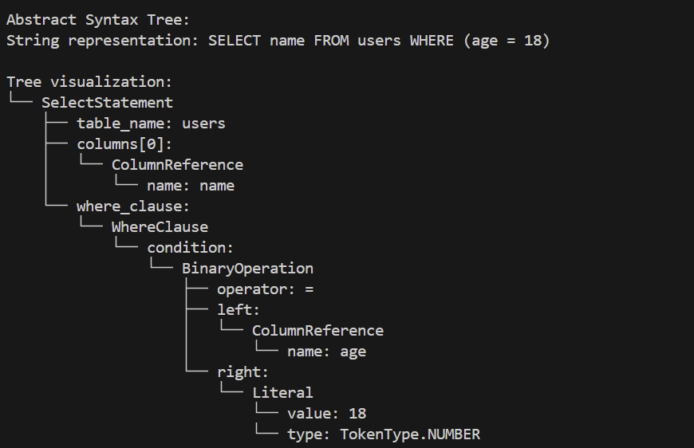
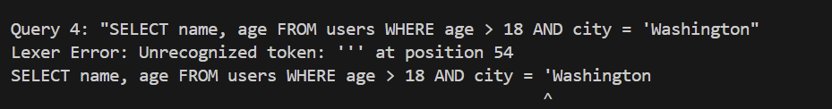
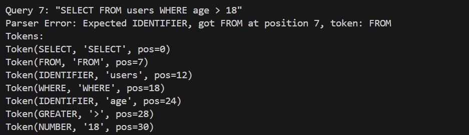

# Laboratory Work No. 6
### Course: Formal Languages & Finite Automata  
### Author: Nicolae Marga
### Group: FAF-231

----
## Theory

**Parsing** is the process of analyzing text according to the rules of a formal grammar. It typically follows lexical analysis (tokenization) and constructs a structured representation of the input text. Parsing involves determining the syntactic structure of the input and validating that it conforms to the expected grammar.

An **Abstract Syntax Tree (AST)** is a hierarchical tree representation of the abstract syntactic structure of source code. Each node in the tree represents a construct in the source code. The AST abstracts away details like parentheses, semicolons, or other syntactic sugar, focusing on the essential structure and meaning of the code.

### Parsing Process

The parsing process typically consists of two main phases. Breaking the input text into tokens, and organizing the tokens into a hierarchical structure. Parsing errors occur when tokens cannot be organized according to the grammar rules, even if individual tokens are valid.


## Objectives
1. Get familiar with parsing, what it is and how it can be programmed [1].
2. Get familiar with the concept of AST [2].
3. In addition to what has been done in the 3rd lab work do the following:
   1. In case you didn't have a type that denotes the possible types of tokens you need to:
      1. Have a type __*TokenType*__ (like an enum) that can be used in the lexical analysis to categorize the tokens. 
      2. Please use regular expressions to identify the type of the token.
   2. Implement the necessary data structures for an AST that could be used for the text you have processed in the 3rd lab work.
   3. Implement a simple parser program that could extract the syntactic information from the input text.


## Implementation Description

### TokenType Enum

The `TokenType` enum was implemented using Python's `Enum` class with `auto()` to assign automatically values. This enum classifies tokens into categories like keywords (SELECT, FROM, WHERE), operators (=, >, <), and literals (identifiers, numbers, strings).

### AST Node Classes

There is a set hierarchy of classes in order to represent different elements of SQL queries in the AST:

- `ASTNode`: Base class for all AST nodes
- `SelectStatement`: Represents a complete SELECT statement
- `CreateProcedureStatement`: Represents a CREATE PROCEDURE statement
- `ColumnReference`: Represents a reference to a column
- `WhereClause`: Represents a WHERE clause with conditions
- `BinaryOperation`: Represents comparison operations (e.g., column = value)
- `LogicalOperation`: Represents logical operations (AND, OR)
- `Literal`: Represents literal values (numbers, strings)
- `Parameter`: Represents parameters in stored procedures

### Parser Implementation

The parser takes a recursive descent approach to processes tokens sequentially and builds an AST. It examines the first token to determine the statement type. It calls specialized methods to parse different parts of the statement, and creates appropriate AST nodes to represent the structure. The parser also handles errors when the input doesn't match the expected grammar.

### Error Handling

There are two types of error handling:

- `LexerError`: For issues with individual tokens or unrecognized characters
- `ParserError`: For issues with the syntactic structure of the query

## Code Implementation
Bellow are some code snippets which showcase how the parser and lexer operates in the code.
### TokenType Enum

```python
class TokenType(Enum):
    SELECT = auto()
    FROM = auto()
    WHERE = auto()
    AND = auto()
    OR = auto()
    EQUALS = auto()
    GREATER = auto()
    LESS = auto()
    IDENTIFIER = auto()
    NUMBER = auto()
    STRING = auto()
    COMMA = auto()
    LPAREN = auto()
    RPAREN = auto()
    CREATE = auto()
    PROCEDURE = auto()
    PARAMETER = auto()
```

### AST Node Classes
The SelectStatement class defines a type of Abstract Syntax Tree node for representing SQL SELECT statements. It takes three attributes: a list of columns to be selected, the name of the table from which the data will be retrieved, and an optional WHERE clause to filter the results. The __str__ method is overridden to provide a string output.

```python
class SelectStatement(ASTNode):
    def __init__(self, columns, table_name, where_clause=None):
        self.columns = columns
        self.table_name = table_name
        self.where_clause = where_clause
    
    def __str__(self):
        result = f"SELECT {', '.join(str(col) for col in self.columns)} FROM {self.table_name}"
        if self.where_clause:
            result += f" WHERE {self.where_clause}"
        return result
```

### Parser Methods
The parse_select_statement method has the role to convert a sequence of tokens into a SelectStatement AST node. It makes sure that the input starts with a SELECT token and then calls another method to parse the list of columns. After that, it expects a FROM token followed by an identifier token representing the table name. This method defines the grammar rule for parsing a SELECT statement in the language being interpreted or compiled.

```python
def parse_select_statement(self) -> SelectStatement:
    """Parse a SELECT statement."""
    # Expect SELECT keyword
    self.expect(TokenType.SELECT)
    
    # Parse column list
    columns = self.parse_column_list()
    
    # Expect FROM keyword
    self.expect(TokenType.FROM)
    
    # Parse table name
    table_token = self.expect(TokenType.IDENTIFIER)
    table_name = table_token.value
    
    # Parse optional WHERE clause
    where_clause = None
    if self.current_token() and self.current_token().type == TokenType.WHERE:
        self.advance()  # Consume WHERE token
        where_clause = self.parse_where_clause()
    
    return SelectStatement(columns, table_name, where_clause)
```

### AST Visualization Function

The print_ast_tree function provides a way to visualize the AST in a tree structure. It prints each node's class name and its attributes. If a node attribute is itself another AST node or a list of AST nodes, the function traverses into it recursively. For simple attribute values, it prints them directly.
```python
def print_ast_tree(node, indent="", is_last=True):
    """Print an AST as a tree structure."""
    # Determine the branch symbol
    branch = "└── " if is_last else "├── "
    
    # Print the current node with proper indentation
    print(f"{indent}{branch}{node.__class__.__name__}")
    
    # Determine the new indentation for children
    new_indent = indent + ("    " if is_last else "│   ")
    
    # Get all attributes of the node that are ASTNodes or lists/dicts containing ASTNodes
    children = []
    for attr_name, attr_value in node.__dict__.items():
        if isinstance(attr_value, ASTNode):
            children.append((attr_name, attr_value))
        elif isinstance(attr_value, list) and attr_value and isinstance(attr_value[0], ASTNode):
            # For lists of nodes (like columns in a SELECT statement)
            for i, item in enumerate(attr_value):
                children.append((f"{attr_name}[{i}]", item))
        elif not isinstance(attr_value, (ASTNode, list)) and attr_value is not None:
            # Print simple values directly
            value_branch = "└── " if not children else "├── "
            print(f"{new_indent}{value_branch}{attr_name}: {attr_value}")
    
    # Recursively print children
    for i, (attr_name, child) in enumerate(children):
        is_last_child = i == len(children) - 1
        label_indent = new_indent
        print(f"{label_indent}{'└── ' if is_last_child else '├── '}{attr_name}:")
        print_ast_tree(child, label_indent + ("    " if is_last_child else "│   "), True)
```

## Results

The implementation parses and creates abstract syntax trees for SQL queries and it has error messages for invalid queries. Here are some of the tested queries:

```python
    queries = [
        "SELECT name, age FROM users WHERE age > 21 AND city = 'New York' AND test = 'TEST'",  # Valid
        "SELECT * FROM users",  # Valid with wildcard
        "SELECT name FROM users WHERE age = 18",  # Valid simple condition
        "SELECT name, age FROM users WHERE age > 18 AND city = 'Washington",  # Unclosed string
        "CREATE PROCEDURE myProc(@param1, @param2) AS BEGIN SELECT * FROM users END",  # Simplified sp
        "SELECT $%^ FROM users",  # Invalid syntax
        "SELECT FROM users WHERE age > 18",  # Missing columns
    ]
```
In Image 1, the parser manages to build an AST for the query ```SELECT name FROM users WHERE (age = 18)``
The tree showcases the hierarchical structure of the query components which consists of SelectStatement as the root, Table name identification, Column selection and WHERE clause with binary operation.


-
In Image 2 demonstrates proper lexer error handling, detecting an unclosed string literal.
```city = 'Washington```
The error message identifies the position of the error, which is position 54.



In Image 3 it is illustrated the parser error handling, which detects a syntax error in SELECT FROM users WHERE age > 18. The error correctly identifies that an IDENTIFIER was expected after SELECT but got FROM instead, and also it shows the token stream for debugging.


## Conclusions

The parser converts SQL queries into structured abstract syntax trees. There are two main steps, which are lexical analysis followed by parsing. There are identified different types of errors: the lexer detects issues with individual tokens, such as unclosed quotes, while the parser catches structural problems like missing required elements. The hierarchical node structure of the AST represents the SQL query components. Also, the parser provides error messages that indicate the type of error, its position, and the difference between expected and received tokens, which helps in debugging. 

Regular expressions are used for token identification and classification during lexical analysis. Recursive parsing is used for handling SQL grammar. Overall, the implementation offers a strong foundation for SQL query processing and can be extended to support more complex operations in the future.

## References:
[1] [Parsing Wiki](https://en.wikipedia.org/wiki/Parsing)

[2] [Abstract Syntax Tree Wiki](https://en.wikipedia.org/wiki/Abstract_syntax_tree)
