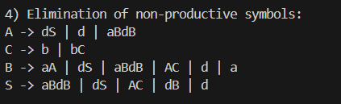
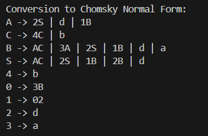

# Laboratory Work No. 5
### Course: Formal Languages & Finite Automata  
### Author: Nicolae Marga
### Group: FAF-231

----
## Theory

In formal language theory, Chomsky Normal Form (CNF) is a simplified form of context-free grammars. A grammar in CNF has all of its production rules in one of the following forms:
- A → BC (a non-terminal produces two non-terminals)
- A → a (a non-terminal produces a single terminal)
- S → ε (only if S is the start symbol and doesn't appear on the right side of any rule)

Converting a grammar to CNF is useful for various algorithms, including the CYK parsing algorithm, which requires the grammar to be in this form. The transformation process involves several steps to eliminate different types of problematic productions.

## Objectives

1. Learn about Chomsky Normal Form (CNF) [1].
2. Get familiar with the approaches of normalizing a grammar.
3. Implement a method for normalizing an input grammar by the rules of CNF.
   1. The implementation needs to be encapsulated in a method with an appropriate signature (also ideally in an appropriate class/type).
   2. The implemented functionality needs executed and tested.
   3. Also, another **BONUS point** would be given if the student will make the aforementioned function to accept any grammar, not only the one from the student's variant.


## Implementation Description

There is implemented a `Grammar` class that can transform any context-free grammar into Chomsky Normal Form. The transformation process follows several well-defined steps, each addressing specific issues in the grammar:

1. Elimination of ε-productions
2. Elimination of unit productions
3. Elimination of inaccessible symbols
4. Elimination of non-productive symbols
5. Conversion to CNF format

#### Steps:

1. **Elimination of ε-productions**:
First, all directly nullable non-terminals must be identified. Then the algorithm finds indirectly nullable non-terminals. For each production containing nullable symbols, all possible combinations where those symbols could be removed are generated. This makes sure that no production can generate the empty string except the start symbol.

2. **Elimination of unit productions**:
The rules of the form A → B where B is a non-terminal are all removed. The algorithm replaces each unit production with the productions of the referenced non-terminal. This process continues until no unit productions remain.

3. **Elimination of inaccessible symbols**:
Starting from the start symbol, all non-terminals that can be reached are tracked. Any non-terminals that cannot be reached from the start symbol are removed.

4. **Elimination of non-productive symbols**:
A non-terminal is productive if it can derive a string of only terminals. The code identifies all productive non-terminals and removes the non-productive ones. This ensures that every remaining non-terminal can participate in generating valid strings.

5. **Conversion to CNF format**:
For productions with more than two symbols, new non-terminals are introduced to break them down. For productions mixing terminals and non-terminals, terminals are replaced with new non-terminals. This results in rules that either have exactly two non-terminals or a single terminal.

### Code Implementation

The main part of the implementation is the `Grammar` class, which contains methods for each transformation step:

```python
class Grammar:
    def __init__(self, non_terminals, terminals, rules, start):
        self.non_terminals = non_terminals
        self.terminals = terminals
        self.rules = rules
        self.start = start

    def eliminate_e_productions(self):
        # Find directly nullable non-terminals
        nullable = set()
        for non_terminal in self.non_terminals:
            for production in self.rules[non_terminal]:
                if production == 'ε':
                    nullable.add(non_terminal)

        # Find indirectly nullable non-terminals
        changes = True
        while changes:
            changes = False
            for non_terminal in self.non_terminals:
                if non_terminal not in nullable:
                    for production in self.rules[non_terminal]:
                        if all(symbol in nullable for symbol in production):
                            nullable.add(non_terminal)
                            changes = True
                            break

        # Generate new rules without epsilon productions
        new_rules = {}
        for non_terminal in self.rules:
            new_prods = []
            for production in self.rules[non_terminal]:
                if production != 'ε':
                    new_prods.extend(self._expand_nullable_prod(production, nullable))
            new_rules[non_terminal] = list(set(new_prods))

        self.rules = new_rules
```

The elimination of unit productions, inaccessible symbols, and non-productive symbols follows a similar pattern, with each method implementing the specific algorithm for that transformation step.

The final step is converting the grammar to CNF format, which involves breaking down long productions and replacing terminals in mixed productions:

```python
# Process for long productions (> 2 symbols)
for non_terminal in list(grammar.rules):
    for production in grammar.rules[non_terminal]:
        while len(production) > 2:
            first_two_symbols = production[:2]
            if first_two_symbols in rhs_to_non_terminal:
                new_non_terminal = rhs_to_non_terminal[first_two_symbols]
            else:
                new_non_terminal = grammar._create_new_non_terminal()
                new_rules[new_non_terminal] = {first_two_symbols}
                rhs_to_non_terminal[first_two_symbols] = new_non_terminal
            production = new_non_terminal + production[2:]
```

## Results

When running the code with the provided grammar (variant 21), the transformation process eliminates all problematic productions and successfully converts the grammar to Chomsky Normal Form. Each step of the process is printed to show the intermediate transformations:

1. After eliminating ε-productions, the grammar no longer contains rules producing the empty string.


2. After eliminating unit productions, all rules produce either terminals or combinations of non-terminals.


3. Removing inaccessible and non-productive symbols simplifies the grammar further.


4. The final conversion to CNF ensures all productions are in the required format.





The program can accept any grammar as input.


## Conclusions

Implementing the conversion to Chomsky Normal Form helped me understand the theoretical aspects of formal grammars better. The different steps of the transformation process address specific issues in the grammar, each with their own algorithmic challenges such as finding nullable non-terminals required a fixed-point algorithm to handle indirect nullability. Also, eliminating unit productions involved tracking changes through multiple iterations, and handling long productions required introducing new non-terminals in a methodical way. This laboratory work showcased how formal language theory can be practically applied through algorithms that manipulate grammar representations. The resulting CNF grammar is also practically useful for parsing applications.

## References

[1] [Chomsky Normal Form Wiki](https://en.wikipedia.org/wiki/Chomsky_normal_form)
